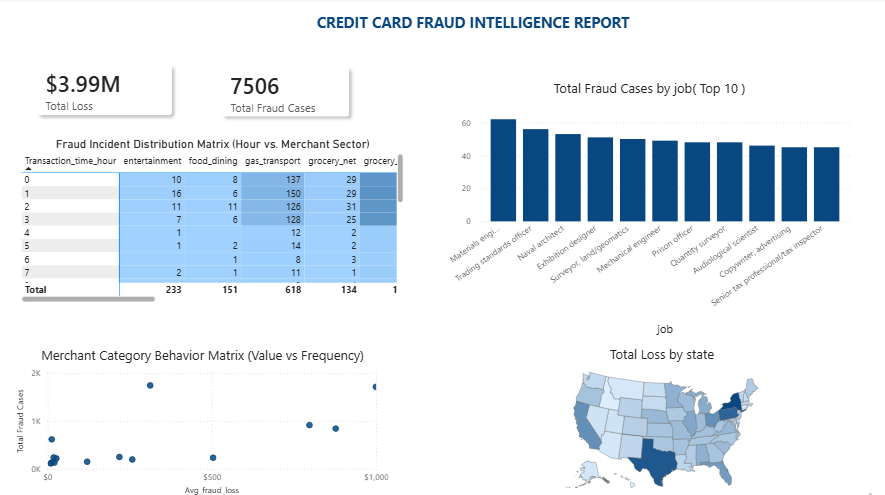
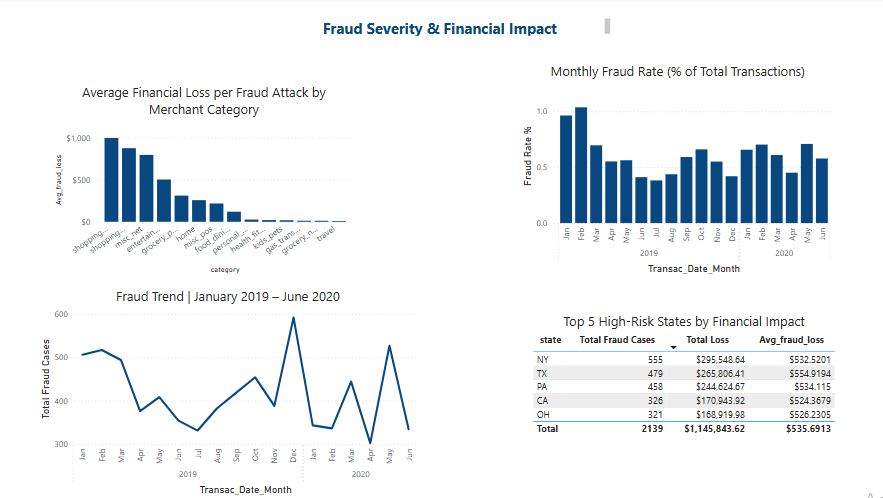

# Credit Card Fraud Analysis Dashboard

## Project Overview
End-to-end data analysis project investigating fraud patterns across 1.2M+ 
credit card transactions (January 2019 – June 2020).

Built a full data pipeline from raw messy CSV → Python cleaning → 
SQL Server → Power BI dashboard.

## Business Questions Answered
- **When** do fraud attacks peak? (Hour of day, day of week, monthly trends)
- **Who** is most targeted? (Job profiles)
- **How** do fraudsters operate? (Merchant categories, transaction values vs frequency)
- **Where** is fraud concentrated? (US states)
- **How bad?** (Total loss, fraud rate %, average loss per attack)

## Dashboard Preview

### Page 1 — Fraud Pattern Overview

### Page 2 — Fraud Severity & Financial Impact

## Key Findings
- Total loss through fraud **$3,988,088.61**
- Total fraud cases **7506**
- Fraud attacks peak between **10PM and 3AM**
- **Grocery POS and Shopping Net** categories show the highest fraud frequency, 
  with **Shopping Net** recording the highest average loss per attack
- **Texas and New York** account for the highest fraud losses
- Fraud rate increased year-over-year — from **0.56%** in 2019 to **0.61%** in 2020
- Average loss per fraud event rose from **$530.23** in 2019 to **$533.80** in 2020

## Technical Pipeline

### 1. Data Ingestion Problem & Solution (Python)
The raw CSV contained embedded commas in text fields that caused 
SQL Server's bulk import to produce misaligned, broken rows.

**Solution:** Used Python (pandas) with chunked reading (100k rows at a time) 
to load the full 1.2M row dataset without memory overflow, then exported 
as a tab-separated file to eliminate delimiter conflicts.

### 2. SQL Server (T-SQL)
- Created staging table schema
- Used BULK INSERT to load cleaned tab-separated data
- Built a SQL View selecting only analytical columns and pre-splitting 
  the combined date-time field into separate date and time columns

### 3. Power BI
- Connected to SQL View (not raw table)
- Built Star Schema with fact table + custom Calendar Dimension table
- Separated date and time in Power Query
- Linked Calendar table via 1-to-many relationship on date field
- Wrote DAX measures for fraud-specific metrics:
  - Total Loss
  - Total Fraud Cases  
  - Average Loss per Fraud
  - Fraud Rate %

## Tools Used
- **Python** (pandas) — data cleaning
- **SQL Server / T-SQL** — data storage and transformation
- **Power BI** — data modeling (Star Schema, DAX) and visualization

## How to Reproduce
1. Download `fraudTrain.csv` from the [dataset source](data/dataset_source.md)
2. Run `python/clean_data.py` (update file paths as needed)
3. Run SQL scripts in order: `01` → `02` → `03`
4. Open Power BI and connect to the `v_Clean_Fraud_data` view

**Note:** The .pbix file connects to a local SQL Server instance. 
To use it, follow the reproduction steps to set up the database locally, 
then update the data source connection in Power BI Desktop 
(Home → Transform data → Data source settings).
